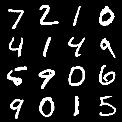
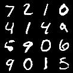
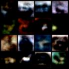

# Autoencoders using PyTorch

## Quick Links
- [About](#about)
- [Setup](#setup)
	- [Installation](#installation)
	- [Training](#training)
- [Results](#results)

## About
<p align="center">
	<br>
	<code>Fig 1: Architecture of an Autoencoder</code>
</p>

## Setup
### Installation
1. Download the GitHub repo by using the following command running from the terminal.
```
git clone https://github.com/arpanmukherjee/Autoencoders-and-more-using-PyTorch.git
cd Autoencoders-and-more-using-PyTorch/
```

2. Install `pip` from the terminal, for more details please look [here](https://pypi.org/project/pip/). Go to the following project folder and install all the dependencies by running the following command. By running this command, it will install all the dependencies you will require to run the project.
```
pip install -r requirements.txt
```

### Training
The network can be trained using `main.py` script. Currently, it only accepts the following arguments with the allowed values. Please strictly follow the argument name and any of the values.

| argument | accepted values | default value |
|--|--|--|
| epochs | integer | 75 |
| batch-size | integer | 16 |
| learning-rate | float | 0.001 |
| seed | int | 1 |
| data-path | data directory | ../dataset/ |
| dataset | MNIST or STL10 or CIFAR10 | - |
| use_cuda | bool | False |
| network-type | FC or Conv | FC |
| weight-decay | float | 1e-5 |
| log-interval | int | 50 |
| save-model | bool | True |

Arguments that have no default value, you must provide value to run the script.
```
python main.py --dataset STL10 --use-cuda True --network-type FC
```
If you think the model is taking too much time, you can consider using GPU. Set `use_cuda` argument as `True`.
## Results
The following are the resultant images for my trained model. I have trained my model on the `MNIST` dataset for `75` epochs.
```
python main.py --dataset MNIST --use-cuda True
```
| Trained Model | Actual Image | Decoded Image |
|--|--|--|
| [MNIST](https://drive.google.com/file/d/1-3oOeUDHCUE45dlHrw7fA9Uj4X1Rlkai/view?usp=sharing) |<p align="center"></p> | <p align="center"></p> |
| [CIFAR10](https://drive.google.com/file/d/1-3l18YKFbQNM6O-xrQeGegYvbGLNL3KC/view?usp=sharing) |<p align="center"></p> | <p align="center"></p> |

As you can see, even though there are some differences, but you can easily identify both the images are the same. In case of `CIFAR10` datatset, images are a little blurry, this could be because I trained my model only `75` epochs.
