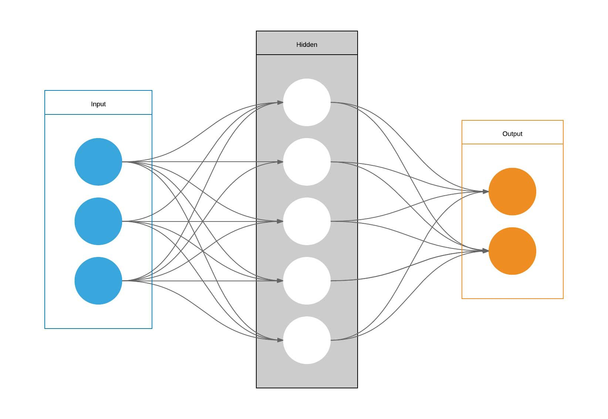

# Autoencoders using PyTorch

## Quick Links
- [About](#About)
- [Setup](#setup)
- [Dataset](#dataset)
- [Results](#results)

## About

	 
	<code>Fig 1: Architecture of an Autoencoder</code>

## Setup
## Dataset
## Results
